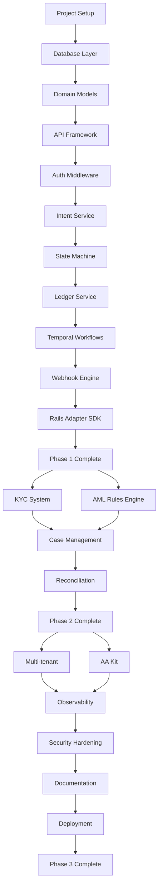

# RampOS - Implementation Plan v1.0

**Document Type**: Implementation Plan
**Version**: 1.0
**Date**: 2026-01-22
**Status**: Draft - Pending Audit

---

## Executive Summary

This document outlines the implementation plan for RampOS, a full-stack crypto/VND exchange infrastructure platform. The plan spans 90 days across 3 phases, with clear milestones, dependencies, and deliverables.

---

## Phase Overview

| Phase | Days | Focus | Key Deliverables |
|-------|------|-------|------------------|
| 1 | 0-30 | Core Orchestrator | State machine, Ledger, APIs, Webhooks |
| 2 | 31-60 | Compliance Pack | KYC, AML, Case Management, Recon |
| 3 | 61-90 | Advanced Features | Multi-tenant, AA Kit, Polish |

---

## Phase 1: Core Orchestrator (Days 0-30)

### Week 1: Foundation (Days 1-7)

#### 1.1 Project Setup (Days 1-2)
- [x] Initialize project structure
- [ ] Set up Rust workspace with Cargo
- [ ] Configure development environment
- [ ] Set up CI/CD pipeline (GitHub Actions)
- [ ] Configure linting (clippy, rustfmt)
- [ ] Set up pre-commit hooks

**Deliverables:**
- `Cargo.toml` workspace configuration
- `.github/workflows/ci.yml`
- Development documentation

#### 1.2 Database Layer (Days 2-4)
- [ ] Set up PostgreSQL with Docker Compose
- [ ] Create migration framework (sqlx-migrate)
- [ ] Implement tenant schema
- [ ] Implement intent schema
- [ ] Implement ledger schema
- [ ] Add seed data for development

**Deliverables:**
- `migrations/` folder with all DDL
- Database connection pool (sqlx)
- `docker-compose.yml` for local dev

#### 1.3 Core Domain Models (Days 4-7)
- [ ] Define Intent types and structures
- [ ] Define Ledger account types
- [ ] Define State machine enums
- [ ] Implement serialization/deserialization
- [ ] Add validation logic
- [ ] Write unit tests for domain models

**Deliverables:**
- `src/domain/` module
- 80%+ test coverage on domain

### Week 2: Intent Engine (Days 8-14)

#### 2.1 API Framework Setup (Days 8-9)
- [ ] Set up Axum web framework
- [ ] Configure request/response types
- [ ] Implement error handling
- [ ] Add request validation middleware
- [ ] Set up OpenAPI documentation

**Deliverables:**
- `src/api/` module
- OpenAPI spec generation

#### 2.2 Authentication & Authorization (Days 9-11)
- [ ] Implement HMAC signature verification
- [ ] Add timestamp validation
- [ ] Create tenant authentication middleware
- [ ] Implement rate limiting (Redis)
- [ ] Add idempotency key handling

**Deliverables:**
- `src/middleware/` module
- Rate limiting with Redis
- Idempotency store

#### 2.3 Intent Service Implementation (Days 11-14)
- [ ] Implement POST /v1/intents/payin
- [ ] Implement POST /v1/intents/payin/confirm
- [ ] Implement POST /v1/intents/payout
- [ ] Implement POST /v1/events/trade-executed
- [ ] Implement GET /v1/intents/{id}
- [ ] Add integration tests

**Deliverables:**
- Complete Intent Service
- API integration tests

### Week 3: State Machine & Ledger (Days 15-21)

#### 3.1 State Machine Implementation (Days 15-17)
- [ ] Implement state transition logic
- [ ] Add transition validation
- [ ] Create state history tracking
- [ ] Handle error states
- [ ] Add timeout handling
- [ ] Write state machine tests

**Deliverables:**
- `src/state_machine/` module
- State transition tests

#### 3.2 Ledger Service (Days 17-19)
- [ ] Implement double-entry logic
- [ ] Create account management
- [ ] Add balance calculations
- [ ] Implement entry creation
- [ ] Add balance verification
- [ ] Ensure atomic transactions

**Deliverables:**
- `src/ledger/` module
- Ledger integrity tests

#### 3.3 Temporal Workflows (Days 19-21)
- [ ] Set up Temporal worker
- [ ] Implement PayinWorkflow
- [ ] Implement PayoutWorkflow
- [ ] Implement TradeWorkflow
- [ ] Add workflow signals
- [ ] Configure retry policies

**Deliverables:**
- `src/workflows/` module
- Temporal integration

### Week 4: Webhooks & Rails (Days 22-28)

#### 4.1 Webhook Engine (Days 22-24)
- [ ] Implement outbox pattern
- [ ] Create webhook dispatcher
- [ ] Add HMAC signing
- [ ] Implement retry logic
- [ ] Add delivery tracking
- [ ] Create webhook tests

**Deliverables:**
- `src/webhooks/` module
- Webhook delivery system

#### 4.2 Rails Adapter SDK (Days 24-26)
- [ ] Define adapter interface
- [ ] Create TypeScript SDK structure
- [ ] Implement mock adapter
- [ ] Add adapter factory pattern
- [ ] Write SDK documentation
- [ ] Create example integration

**Deliverables:**
- `sdk/typescript/` package
- Mock rails adapter

#### 4.3 Integration & Testing (Days 26-28)
- [ ] End-to-end payin flow test
- [ ] End-to-end payout flow test
- [ ] Load testing setup (k6)
- [ ] Performance optimization
- [ ] Documentation update

**Deliverables:**
- E2E test suite
- Performance benchmarks

### Week 4.5: Phase 1 Wrap-up (Days 28-30)

#### 4.4 Audit & Polish (Days 28-30)
- [ ] Security review
- [ ] Code review
- [ ] Documentation finalization
- [ ] Staging deployment
- [ ] Demo preparation

**Deliverables:**
- Phase 1 complete
- Staging environment running

---

## Phase 2: Compliance Pack (Days 31-60)

### Week 5: KYC System (Days 31-37)

#### 5.1 KYC Tier Management (Days 31-33)
- [ ] Implement tier definitions
- [ ] Create limit configurations
- [ ] Add tier upgrade logic
- [ ] Implement tier checks
- [ ] Add admin API for tier management

**Deliverables:**
- KYC tier system
- Tier management API

#### 5.2 KYC Integration (Days 33-37)
- [ ] Define eKYC provider interface
- [ ] Implement mock KYC provider
- [ ] Add KYC verification workflow
- [ ] Create KYC status tracking
- [ ] Add document storage (S3)

**Deliverables:**
- KYC verification flow
- Provider integration interface

### Week 6: AML Rules Engine (Days 38-44)

#### 6.1 Rules Engine Core (Days 38-40)
- [ ] Design rule definition format
- [ ] Implement rule parser
- [ ] Create rule evaluation engine
- [ ] Add rule caching
- [ ] Implement rule versioning

**Deliverables:**
- Rule engine core
- Rule definition schema

#### 6.2 Built-in AML Rules (Days 40-42)
- [ ] Implement velocity check
- [ ] Implement structuring detection
- [ ] Implement unusual payout detection
- [ ] Implement device/IP anomaly
- [ ] Add sanctions screening integration

**Deliverables:**
- Default AML rule set
- Sanctions integration

#### 6.3 Risk Scoring (Days 42-44)
- [ ] Implement risk score calculation
- [ ] Add score aggregation
- [ ] Create threshold configurations
- [ ] Implement action triggers
- [ ] Add score history tracking

**Deliverables:**
- Risk scoring system
- Action automation

### Week 7: Case Management (Days 45-51)

#### 7.1 Case Workflow (Days 45-47)
- [ ] Implement case creation
- [ ] Add case assignment
- [ ] Create case status transitions
- [ ] Add case notes/comments
- [ ] Implement case resolution

**Deliverables:**
- Case management system

#### 7.2 Admin Dashboard (Days 47-49)
- [ ] Set up React admin app
- [ ] Create case list view
- [ ] Add case detail view
- [ ] Implement action buttons
- [ ] Add search/filter functionality

**Deliverables:**
- Admin UI for case management

#### 7.3 Reporting (Days 49-51)
- [ ] Create SAR report template
- [ ] Implement report generation
- [ ] Add report export (PDF/CSV)
- [ ] Create report scheduling
- [ ] Add audit trail for reports

**Deliverables:**
- Compliance reporting system

### Week 8: Reconciliation (Days 52-58)

#### 8.1 Recon Engine (Days 52-54)
- [ ] Design recon batch system
- [ ] Implement ledger reconciliation
- [ ] Add external statement import
- [ ] Create mismatch detection
- [ ] Implement auto-match logic

**Deliverables:**
- Reconciliation engine

#### 8.2 Recon Dashboard (Days 54-56)
- [ ] Create recon batch list
- [ ] Add mismatch review UI
- [ ] Implement manual matching
- [ ] Add batch approval workflow
- [ ] Create recon reports

**Deliverables:**
- Recon UI

#### 8.3 Phase 2 Integration (Days 56-58)
- [ ] Integrate KYC with intent flows
- [ ] Integrate AML with state machine
- [ ] E2E compliance tests
- [ ] Performance testing
- [ ] Documentation update

**Deliverables:**
- Phase 2 integration complete

### Week 8.5: Phase 2 Wrap-up (Days 58-60)

#### 8.4 Audit & Polish (Days 58-60)
- [ ] Security review of compliance
- [ ] Compliance logic review
- [ ] Documentation finalization
- [ ] Staging deployment
- [ ] Demo preparation

**Deliverables:**
- Phase 2 complete
- Compliance pack ready

---

## Phase 3: Advanced Features (Days 61-90)

### Week 9: Multi-tenant Hardening (Days 61-67)

#### 9.1 Tenant Isolation (Days 61-63)
- [ ] Implement data isolation
- [ ] Add tenant-specific configs
- [ ] Create tenant onboarding flow
- [ ] Implement tenant suspension
- [ ] Add tenant billing hooks

**Deliverables:**
- Multi-tenant isolation

#### 9.2 Tenant Admin (Days 63-65)
- [ ] Create tenant admin portal
- [ ] Add API key management
- [ ] Implement webhook configuration
- [ ] Add limit configuration
- [ ] Create tenant reports

**Deliverables:**
- Tenant self-service portal

#### 9.3 Tenant SDK (Days 65-67)
- [ ] Enhance TypeScript SDK
- [ ] Create Go SDK
- [ ] Add SDK documentation
- [ ] Create SDK examples
- [ ] Publish to npm/go modules

**Deliverables:**
- Production-ready SDKs

### Week 10: Account Abstraction Kit (Days 68-74)

#### 10.1 Smart Contracts (Days 68-70)
- [ ] Set up Foundry project
- [ ] Implement Account Factory
- [ ] Implement Smart Account
- [ ] Create Session Key Module
- [ ] Add comprehensive tests

**Deliverables:**
- `contracts/` folder
- Smart contract tests

#### 10.2 Bundler & Paymaster (Days 70-72)
- [ ] Implement bundler service
- [ ] Create paymaster contract
- [ ] Add gas estimation
- [ ] Implement UserOp validation
- [ ] Add gas sponsorship logic

**Deliverables:**
- ERC-4337 bundler
- Paymaster integration

#### 10.3 AA SDK Integration (Days 72-74)
- [ ] Add AA functions to SDK
- [ ] Create smart account helpers
- [ ] Add session key management
- [ ] Implement gasless transactions
- [ ] Write AA documentation

**Deliverables:**
- AA-enabled SDK

### Week 11: Observability & Security (Days 75-81)

#### 11.1 OpenTelemetry Setup (Days 75-77)
- [ ] Instrument all services
- [ ] Set up trace collector
- [ ] Configure metrics export
- [ ] Add custom metrics
- [ ] Create dashboards

**Deliverables:**
- Full observability stack

#### 11.2 Security Hardening (Days 77-79)
- [ ] Security audit
- [ ] Implement SPIFFE/SPIRE
- [ ] Add Vault integration
- [ ] Configure mTLS
- [ ] Penetration testing

**Deliverables:**
- Security hardened deployment

#### 11.3 Performance Optimization (Days 79-81)
- [ ] Load testing at scale
- [ ] Identify bottlenecks
- [ ] Optimize hot paths
- [ ] Add caching layers
- [ ] Verify SLO compliance

**Deliverables:**
- Performance verified

### Week 12: Delivery (Days 82-88)

#### 12.1 Documentation (Days 82-84)
- [ ] API documentation
- [ ] Integration guides
- [ ] Operations manual
- [ ] Runbook creation
- [ ] Architecture diagrams

**Deliverables:**
- Complete documentation

#### 12.2 Deployment Automation (Days 84-86)
- [ ] Finalize Kubernetes manifests
- [ ] Configure ArgoCD
- [ ] Set up environments
- [ ] Create deployment scripts
- [ ] Add rollback procedures

**Deliverables:**
- GitOps deployment ready

#### 12.3 Production Readiness (Days 86-88)
- [ ] Production checklist
- [ ] Disaster recovery plan
- [ ] Backup verification
- [ ] Monitoring alerts
- [ ] On-call procedures

**Deliverables:**
- Production ready

### Week 12.5: Final Wrap-up (Days 88-90)

#### 12.4 Final Review & Launch (Days 88-90)
- [ ] Final security review
- [ ] Stakeholder demo
- [ ] Documentation review
- [ ] Launch checklist
- [ ] Production deployment

**Deliverables:**
- RampOS v1.0 launched

---

## Dependencies

---

## Risk Register

| Risk | Impact | Probability | Mitigation |
|------|--------|-------------|------------|
| Temporal learning curve | Medium | High | Allocate extra time, use examples |
| Smart contract security | High | Medium | External audit, extensive testing |
| Performance targets | Medium | Medium | Early load testing, optimization |
| Bank integration complexity | High | Medium | Abstract with adapter pattern |
| Regulatory changes | High | Low | Modular compliance rules |

---

## Success Criteria

### Phase 1
- [ ] All API endpoints functional
- [ ] State machines handle all paths
- [ ] Ledger maintains integrity
- [ ] Webhooks deliver reliably
- [ ] Tests pass with >80% coverage

### Phase 2
- [ ] KYC tiers enforced
- [ ] AML rules evaluate correctly
- [ ] Cases created and managed
- [ ] Reconciliation working
- [ ] Compliance tests pass

### Phase 3
- [ ] Multi-tenant isolation verified
- [ ] AA transactions work gaslessly
- [ ] Security audit passed
- [ ] SLO targets met
- [ ] Production deployment successful

---

## Team Allocation

| Role | Allocation | Focus |
|------|------------|-------|
| Backend Engineer (Rust) | 2 FTE | Core services |
| Backend Engineer (Go) | 1 FTE | Adapters, tools |
| Frontend Engineer | 1 FTE | Admin dashboard |
| Smart Contract Engineer | 0.5 FTE | AA contracts |
| DevOps Engineer | 0.5 FTE | Infrastructure |
| QA Engineer | 0.5 FTE | Testing |

---

## Milestones

| Milestone | Date | Deliverable |
|-----------|------|-------------|
| M1: Core API | Day 14 | Intent endpoints live |
| M2: State + Ledger | Day 21 | Full transaction flow |
| M3: Phase 1 Complete | Day 30 | Production-ready core |
| M4: KYC + AML | Day 44 | Compliance engine |
| M5: Phase 2 Complete | Day 60 | Compliance pack ready |
| M6: AA Kit | Day 74 | Smart contracts + bundler |
| M7: Phase 3 Complete | Day 90 | Full platform launched |
