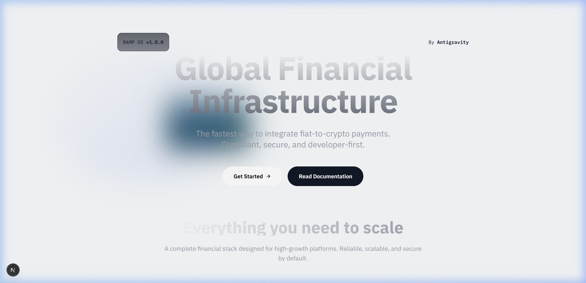
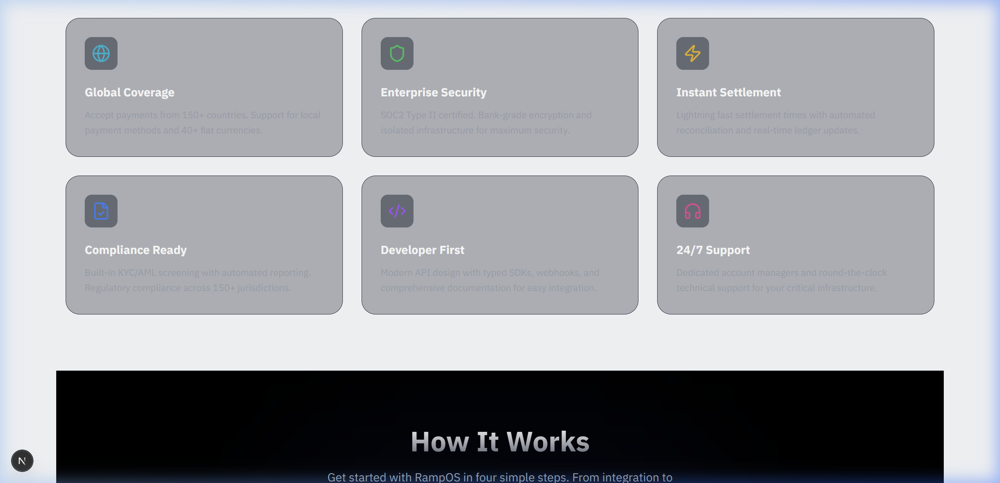
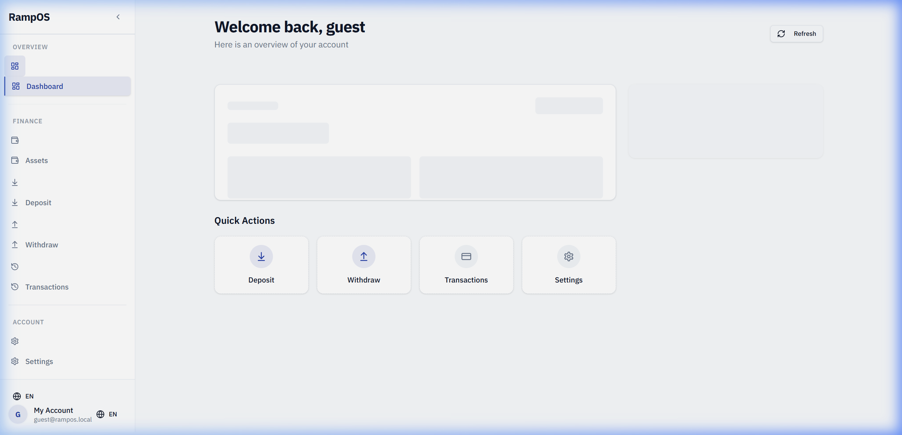
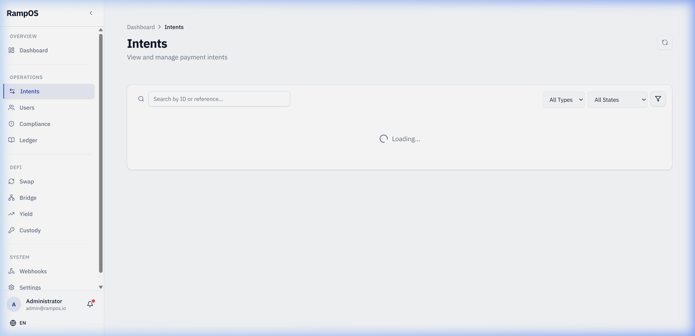
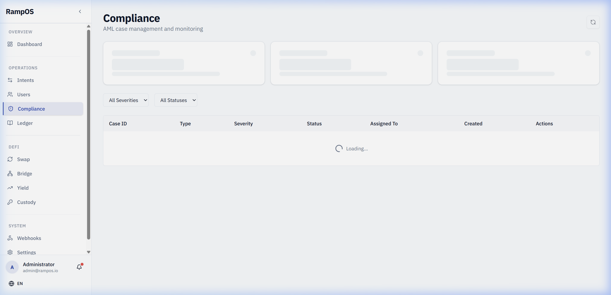
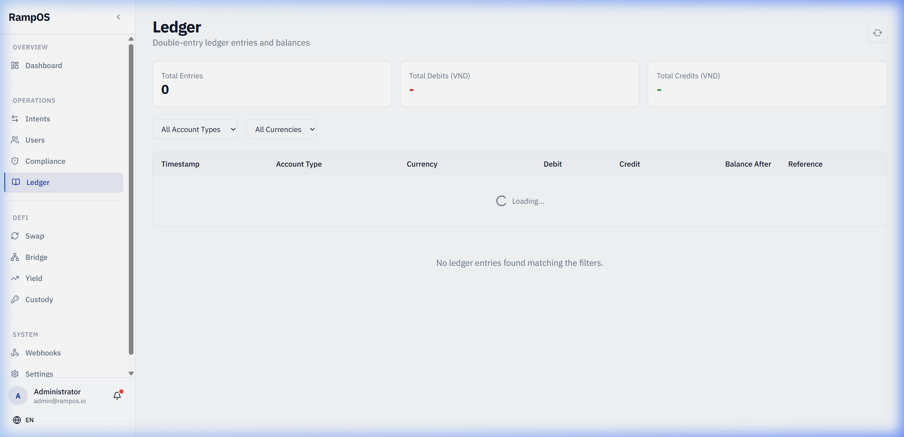

<p align="center">
  <h1 align="center">RampOS</h1>
  <p align="center">
    <strong>Bring Your Own Rails (BYOR) — Crypto/Fiat Exchange Infrastructure</strong>
  </p>
</p>

<p align="center">
  
  
  
  
</p>

> 🇻🇳 [Đọc bản Tiếng Việt](README.vi.md)

<p align="center">
  <a href="#features">Features</a> |
  <a href="#screenshots">Screenshots</a> |
  <a href="#architecture">Architecture</a> |
  <a href="#quick-start">Quick Start</a> |
  <a href="#api-overview">API</a> |
  <a href="#smart-contracts">Contracts</a> |
  <a href="#sdk">SDK</a>
</p>

---

## Overview

RampOS is a **production-grade orchestration layer** for crypto/fiat exchanges. It handles the entire transaction lifecycle — from fiat deposit to crypto trading to fiat withdrawal — with built-in compliance, account abstraction, and multi-tenant isolation.

Built with **Rust** for performance and memory safety, **Solidity** for on-chain logic, and **Next.js** for the admin dashboard.

### Key Principles

- **BYOR (Bring Your Own Rails)** — Keep your banking relationships, plug any bank/PSP
- **Zero Liability** — RampOS never holds customer funds
- **Compliance-First** — FATF Travel Rule & Vietnam AML Law 2022
- **Intent-Based** — All operations are signed, auditable intents
- **Double-Entry Ledger** — Financial-grade accounting with complete audit trail

---

## Screenshots

### Landing Page
> Marketing site with hero, feature cards, how-it-works flow, and developer API showcase.

<p align="center">
  
</p>
<p align="center">
  
</p>

### User Portal
> Self-service portal for end users with deposit, withdraw, asset management, and transaction history.

<p align="center">
  
</p>

### Operations — Intent Management
> Search, filter, and manage all payment intents (pay-in, pay-out, trade) by type and state.

<p align="center">
  
</p>

### Compliance Dashboard
> KYC/AML case management — review flagged transactions, manage compliance cases.

<p align="center">
  
</p>

### Double-Entry Ledger
> Real-time accounting view with complete audit trail for every transaction.

<p align="center">
  
</p>

### Admin Login
> Secure admin key authentication for dashboard access.

<p align="center">
  
</p>

---

## Features

### 🎯 Intent Engine (`ramp-core/intents`) — The Core of RampOS

RampOS is built around a **declarative Intent System** — users express *what* they want to do, and the engine figures out *how* to execute it optimally:

```
User Intent: "Swap 1000 USDC on Ethereum → USDT on Arbitrum"
     ↓ IntentSolver evaluates all routes
     ↓ Route A: Bridge USDC → Arbitrum, then Swap (score: 0.82)
     ↓ Route B: Swap USDC→USDT on Ethereum, then Bridge (score: 0.71)
     ↓ Selects Route A → generates ExecutionPlan
     ↓ WorkflowEngine persists & executes each step durably
```

**4 Intent Action Types:**
| Action | Same-chain | Cross-chain | Steps |
|--------|-----------|-------------|-------|
| `Swap` | Direct DEX swap | Bridge+Swap or Swap+Bridge (auto-selected) | 2–5 |
| `Bridge` | — | Across / Stargate (auto provider) | 3 |
| `Send` | Direct transfer | Bridge+Transfer | 1–4 |
| `Stake` | Direct stake | Bridge+Stake | 2–5 |

**Smart Route Optimization:**
- Gas cost estimation per chain (Ethereum, Arbitrum, Base, Optimism, Polygon)
- Time estimation with bridge wait periods (5min L2→L2, 10min L1→L2, 1hr L2→L1)
- Composite scoring: 40% gas efficiency + 40% speed + 20% fewest steps
- Slippage-aware: configurable `max_slippage_bps` (default 0.5%), MEV protection
- Constraint enforcement: max gas USD, max steps, execution deadline

**Dual-Mode Workflow Engine:**
- **InProcess mode** (dev/test) — Tokio async tasks + optional PostgreSQL state persistence for crash recovery
- **Temporal mode** (production) — Full durable execution via Temporal server gRPC, automatic retries, workflow history, signal handling (e.g. manual bank confirmation)
- **Automatic fallback** — If Temporal server is unreachable, seamlessly falls back to in-process

**Compensation & Rollback:**
- Every multi-step workflow has compensation steps for automatic rollback on failure
- Escrow-based intermediate state ensures no fund loss during partial failures
- `compensation.rs` handles saga-pattern rollback across all transaction types

### 🔧 Core Services (`ramp-core/service`)

| Service | Description |
|---------|-------------|
| **Pay-in** | Full lifecycle: initiate → bank confirmation → ledger credit → webhook |
| **Pay-out** | Compliance checks → ledger debit → rails transfer → confirmation |
| **Trade** | Crypto trade recording with VND↔crypto double-entry |
| **Escrow** | Funds locked in escrow during processing; auto-release or rollback |
| **Settlement** | End-of-day settlement between rails providers |
| **Reconciliation** | Automatic daily reconciliation between ledger and bank statements |
| **Exchange Rate** | Real-time rate engine with configurable spread and rate sources |
| **Withdraw** | Full withdrawal flow with policy engine and per-tenant limits |
| **Withdraw Policy** | Per-tenant, per-user configurable withdrawal policies |
| **Webhook Delivery** | Guaranteed delivery with retry, HMAC signing, and DLQ |
| **Webhook DLQ** | Dead Letter Queue for permanently failed webhooks |
| **Passkey Auth** | Server-side WebAuthn verification for passkey-secured accounts |
| **License** | Per-tenant license management: tier, expiry, feature flags |
| **Onboarding** | Streamlined user onboarding with KYC tier progression |
| **Metrics** | Internal metrics collection for Prometheus export |

### 🏦 Compliance Engine (`ramp-compliance`)
- **KYC Tiering** — Tier 1/2/3 with configurable limits; integrations with Onfido and eKYC providers
- **AML Rules Engine** — Velocity checks, structuring detection, device anomaly analysis
- **Fraud Scoring** — ML-ready feature extraction, risk scoring, and decision engine
- **Sanctions Screening** — OpenSanctions integration with configurable providers
- **Case Management** — Full workflow with notes, status tracking, and resolution
- **Regulatory Reporting** — Automated SAR/CTR generation in SBV (State Bank of Vietnam) format
- **SBV Scheduler** — Automated report scheduling for Vietnam's central bank
- **Fuzz Testing** — Dedicated fuzz targets for compliance rule edge cases

### ⛓️ Smart Contracts (Solidity 0.8.24 / Foundry)

| Contract | Description |
|----------|-------------|
| `RampOSAccount.sol` | ERC-4337 Smart Account — ECDSA owner, batch execution, UUPS upgradeable |
| `RampOSAccountFactory.sol` | Deterministic CREATE2 account deployment |
| `RampOSPaymaster.sol` | Gas sponsorship for gasless transactions |
| `VNDToken.sol` | Stable token for VND representation on-chain |
| `PasskeySigner.sol` | WebAuthn/Passkey on-chain signature verification |
| `PasskeyAccountFactory.sol` | Account factory with passkey authentication |
| `EIP7702Auth.sol` | EIP-7702 authorization for EOA delegation |
| `EIP7702Delegation.sol` | Smart contract delegation for EOAs |
| `ZkKycRegistry.sol` | Zero-Knowledge KYC status registry |
| `ZkKycVerifier.sol` | ZK-proof verifier for privacy-preserving compliance |

### 🌐 Multi-Chain Support (`ramp-core/chain`)
- **EVM Chains** — Ethereum, Polygon, Arbitrum, Base, BSC
- **Solana** — Native SOL and SPL token support
- **TON** — The Open Network integration
- **Cross-Chain** — Bridge support via Across and Stargate protocols
- **DEX Aggregation** — Swap routing across multiple DEXes
- **Oracle Integration** — Chainlink price feeds with fallback providers

### 🔐 Custody & Key Management (`ramp-core/custody`)
- **MPC Signing** — Multi-Party Computation key generation and transaction signing
- **Policy Engine** — Configurable approval policies per operation type
- **Key Rotation** — Automated key lifecycle management

### 💰 Billing & Metering (`ramp-core/billing`)
- **Usage Metering** — Track API calls, transaction volume per tenant
- **Stripe Integration** — Automated billing based on metered usage

### 🖥️ Frontend Applications

#### Admin Dashboard (Next.js 15 + React)
- Real-time dashboard with WebSocket updates and Recharts visualization
- Intent management with search, filter, and status tracking
- User management with KYC status overview
- Compliance case review and resolution workflow
- Double-entry ledger explorer
- System settings: branding, domains, API keys, roles
- **Internationalization** — English and Vietnamese (next-intl)
- **E2E Tests** — Playwright test suite

#### User Portal
- Self-service deposit and withdrawal
- Asset portfolio overview
- Transaction history
- Account settings

#### Embeddable Widget
- Drop-in on-ramp/off-ramp widget for any dApp
- CDN-ready distribution

---

## Architecture

```
┌──────────────────┐     ┌──────────────────┐     ┌──────────────────┐
│    Exchange       │     │     RampOS        │     │   Bank / PSP     │
│   (Tenant)        │◄───►│   Orchestrator    │◄───►│   (Rails)        │
└──────────────────┘     └────────┬─────────┘     └──────────────────┘
                                  │
                    ┌─────────────┼─────────────┐
                    ▼             ▼             ▼
             ┌────────────┐ ┌─────────┐ ┌────────────┐
             │ Blockchain  │ │ Oracles │ │ Compliance │
             │  Networks   │ │         │ │  Providers │
             └────────────┘ └─────────┘ └────────────┘
```

### Rust Workspace (7 crates)

| Crate | Description | Key Dependencies |
|-------|-------------|-----------------|
| `ramp-api` | REST API Gateway | Axum 0.7, Tower, OpenTelemetry |
| `ramp-core` | Business logic, state machine, 119 modules | Tokio, SQLx, async-nats |
| `ramp-ledger` | Double-entry accounting | rust_decimal |
| `ramp-compliance` | KYC/AML/KYT, 64 modules | Fuzz testing, report generation |
| `ramp-aa` | Account Abstraction (ERC-4337) | Alloy |
| `ramp-adapter` | Bank/PSP integration SDK | Pluggable provider trait |
| `ramp-common` | Shared types & errors | serde, thiserror |

### Project Structure

```
rampos/
├── crates/                # 7 Rust workspace crates
│   ├── ramp-api/           # HTTP API (Axum) — 101 files
│   ├── ramp-core/          # Business logic — 126 files
│   │   ├── billing/         # Metering, Stripe
│   │   ├── bridge/          # Across, Stargate
│   │   ├── chain/           # EVM, Solana, TON, swaps
│   │   ├── crosschain/      # Executor, relayer
│   │   ├── custody/         # MPC keys, signing, policies
│   │   ├── intents/         # Solver, execution, unified balance
│   │   ├── oracle/          # Chainlink, fallback
│   │   └── ...
│   ├── ramp-compliance/    # KYC/AML engine — 75 files
│   │   ├── aml/             # Device anomaly detection
│   │   ├── fraud/           # Scoring, analytics, features
│   │   ├── kyc/             # Onfido, eKYC, tiering
│   │   ├── kyt/             # Chainalysis integration
│   │   ├── sanctions/       # OpenSanctions
│   │   └── reports/         # SAR/CTR, SBV format
│   ├── ramp-ledger/        # Double-entry ledger
│   ├── ramp-aa/            # Account Abstraction
│   ├── ramp-adapter/       # Rails adapter SDK
│   └── ramp-common/        # Shared types
├── contracts/              # 10 Solidity contracts (Foundry)
│   ├── src/
│   │   ├── passkey/         # WebAuthn on-chain
│   │   ├── eip7702/         # EOA delegation
│   │   └── zk/             # Zero-Knowledge KYC
│   ├── test/               # 18 test files
│   └── script/             # 8 deployment scripts
├── sdk/                    # TypeScript SDK
├── sdk-go/                 # Go SDK
├── sdk-python/             # Python SDK
├── packages/widget/        # Embeddable widget
├── frontend/               # Admin Dashboard (Next.js 15)
├── frontend-landing/       # Marketing site
├── migrations/             # 65 PostgreSQL migrations
├── k8s/                    # Kubernetes (Kustomize)
│   ├── base/               # Core manifests, HA Postgres, PgBouncer
│   ├── jobs/               # Backup jobs (Postgres, Redis, NATS → S3)
│   ├── monitoring/         # Prometheus, Grafana
│   └── overlays/           # Staging/Production configs
├── monitoring/             # Grafana dashboards, Prometheus rules
├── argocd/                 # GitOps deployment
└── docs/                   # Documentation
```

---

## Quick Start

### Prerequisites

| Component | Version | Purpose |
|-----------|---------|---------|
| Rust | 1.75+ | Backend API |
| PostgreSQL | 16+ | Primary database |
| Redis | 7+ | Cache, rate limiting, idempotency |
| NATS | 2.10+ | Event streaming |
| Node.js | 18+ | Frontend, SDKs |
| Foundry | Latest | Smart contracts |

### Installation

```bash
# Clone the repository
git clone https://github.com/hadesloc/RampOS.git
cd RampOS

# Copy environment configuration
cp .env.example .env
# Edit .env — fill in passwords (see comments for generation commands)

# Start infrastructure
docker-compose up -d postgres redis nats

# Run database migrations
cargo install sqlx-cli
sqlx migrate run

# Build and run
cargo build --release
cargo run --release --package ramp-api
```

The API server will be available at `http://localhost:8080`.

### Using Docker

```bash
# Full stack
docker-compose up --build

# Or infrastructure only
docker-compose up -d postgres redis nats clickhouse
docker-compose up ramp-api
```

### Frontend (Admin Dashboard)

```bash
cd frontend
cp .env.local.example .env.local
npm install
npm run dev
# → http://localhost:3000
```

---

## API Overview

### Intent Lifecycle

| Method | Endpoint | Description |
|--------|----------|-------------|
| `POST` | `/v1/intents/payin` | Create fiat deposit intent |
| `POST` | `/v1/intents/payin/confirm` | Confirm deposit from bank |
| `POST` | `/v1/intents/payout` | Create fiat withdrawal intent |
| `POST` | `/v1/events/trade-executed` | Record crypto trade |
| `GET` | `/v1/intents/{id}` | Get intent status |

### Example: Create Pay-in

```bash
curl -X POST http://localhost:8080/v1/intents/payin \
  -H "Authorization: Bearer YOUR_API_KEY" \
  -H "Content-Type: application/json" \
  -H "Idempotency-Key: unique-key-123" \
  -d '{
    "user_id": "usr_123",
    "amount_vnd": 1000000,
    "rails_provider": "VIETCOMBANK"
  }'
```

---

## Smart Contracts

### Deploy

```bash
cd contracts
forge install
forge script script/Deploy.s.sol --rpc-url sepolia --broadcast
forge verify-contract <ADDRESS> RampOSAccountFactory --chain sepolia
```

### Highlights

| Feature | Contract | Standard |
|---------|----------|----------|
| Smart Accounts | `RampOSAccount.sol` | ERC-4337 |
| Gas Sponsorship | `RampOSPaymaster.sol` | ERC-4337 |
| Passkey Login | `PasskeySigner.sol` | WebAuthn |
| EOA Delegation | `EIP7702Delegation.sol` | EIP-7702 |
| Privacy KYC | `ZkKycRegistry.sol` | ZK Proofs |
| VND Stablecoin | `VNDToken.sol` | ERC-20 |

---

## SDK

### TypeScript

```typescript
import { RampOSClient } from '@rampos/sdk';

const client = new RampOSClient({
  apiKey: 'your_api_key',
  baseUrl: 'http://localhost:8080'
});

const payin = await client.payins.create({
  userId: 'usr_123',
  amountVnd: 1000000
});
```

### Go

```go
import "github.com/hadesloc/rampos-go"

client := rampos.NewClient("your_api_key")
payin, err := client.Payins.Create(ctx, &rampos.CreatePayinRequest{
    UserID:    "usr_123",
    AmountVND: 1000000,
})
```

### Python

```python
from rampos import RampOSClient

client = RampOSClient(api_key="your_api_key")
payin = client.payins.create(user_id="usr_123", amount_vnd=1000000)
```

---

## Tech Stack

| Layer | Technology |
|-------|------------|
| **Backend** | Rust, Tokio, Axum, SQLx |
| **Database** | PostgreSQL 16 (65 migrations) |
| **Cache** | Redis 7 |
| **Messaging** | NATS JetStream |
| **Analytics** | ClickHouse |
| **Smart Contracts** | Solidity 0.8.24, Foundry |
| **Frontend** | Next.js 15, React, Tailwind CSS, Recharts |
| **Crypto** | AES-256-GCM, Argon2, HMAC-SHA256, JWT |
| **Infrastructure** | Kubernetes, ArgoCD, PgBouncer |
| **Observability** | OpenTelemetry, Prometheus, Grafana |
| **Testing** | Playwright (E2E), Vitest, Foundry fuzz |

---

## Infrastructure

### Kubernetes (Production-Ready)
- **PostgreSQL HA** — Primary + streaming replicas with automated failover
- **PgBouncer** — Connection pooling for high concurrency
- **Automated Backups** — Postgres, Redis, NATS → S3 with retention policies
- **Network Policies** — Pod-level isolation
- **HPA/PDB** — Auto-scaling and disruption budgets
- **Kustomize Overlays** — Staging and production configurations

### Security
- AES-256-GCM encryption for sensitive data at rest
- Argon2 password hashing
- HMAC-SHA256 webhook signature verification
- JWT authentication with role-based access
- Rate limiting and request timeout protection
- Kubernetes NetworkPolicies and mTLS-ready architecture

---

## Contributing

Contributions are welcome! Please see [CONTRIBUTING.md](CONTRIBUTING.md) for guidelines.

```bash
git checkout -b feature/amazing-feature
git commit -m 'feat: add amazing feature'
git push origin feature/amazing-feature
# Open a Pull Request
```

---

## License

This project is licensed under the **GNU Affero General Public License v3.0 (AGPL-3.0)**.

This means:
- ✅ You can view, modify, and use this code for **personal and educational** purposes
- ✅ You can contribute back to this project
- ⚠️ If you use this software to provide a **network service** (SaaS), you **must** release your complete source code under AGPL-3.0
- ❌ You **cannot** use this in a proprietary/closed-source commercial product without making your entire codebase open source

See [LICENSE](LICENSE) for the full license text.

---

<p align="center">
  Built with Rust 🦀 | Powered by Open Source
</p>
