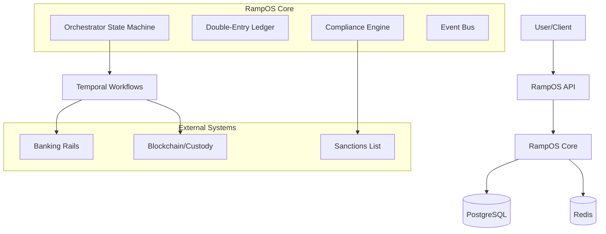

# RampOS Architecture

## Overview

RampOS is a "Bring Your Own Rails" (BYOR) crypto/fiat exchange infrastructure. It provides the core orchestrator, compliance engine, and ledger for operating an exchange, while allowing the operator to plug in their own banking rails and custody providers.

## High-Level Architecture

## Core Components

### 1. RampOS API (`crates/ramp-api`)
- **Framework**: Rust (Axum)
- **Role**: API Gateway, Authentication, Input Validation
- **Features**:
  - RESTful endpoints
  - OpenAPI documentation
  - Rate limiting (Redis-backed)
  - Idempotency handling
  - Bearer token authentication

### 2. RampOS Core (`crates/ramp-core`)
- **Role**: Business Logic, State Management
- **Key Modules**:
  - **Intent System**: Manages lifecycle of Payins, Payouts, and Trades.
  - **Ledger Service**: Handles double-entry accounting.
  - **Repositories**: Data access layer for PostgreSQL.

### 3. Compliance Engine (`crates/ramp-compliance`)
- **Role**: KYC, AML, Risk Management
- **Features**:
  - Rule-based transaction monitoring.
  - Integration with sanctions lists.
  - Case management for manual review.
  - Report generation (SAR, CTR).

### 4. Account Abstraction Kit (`crates/ramp-aa`)
- **Role**: Blockchain Interaction
- **Features**:
  - ERC-4337 Smart Account management.
  - Paymaster service for gas sponsorship.
  - Session key management.

### 5. Orchestration (Temporal)
- **Role**: Reliable Workflow Execution
- **Workflows**:
  - `PayinWorkflow`: Monitors bank deposits, updates ledger.
  - `PayoutWorkflow`: Validates policy, executes bank transfer.
  - `TradeWorkflow`: Executes atomic swap (ledger update).
- **Benefits**:
  - Retries on failure.
  - Long-running processes (e.g., waiting for bank settlement).
  - Visibility into workflow state.

## Data Model

### Database (PostgreSQL)
- **Tenants**: Isolation of data per exchange operator.
- **Users**: End-users of the exchange.
- **Accounts/Balances**: Ledger accounts.
- **Ledger Entries**: Immutable transaction log.
- **Intents**: State of operations (Created -> Pending -> Completed).

### Ledger Design
- **Double-Entry**: Every transaction has at least two entries (debit/credit).
- **Assets**: Supports VND (fiat) and Crypto (BTC, ETH, etc.).
- **Account Types**:
  - `User`: Customer funds.
  - `System`: Platform fees, suspense accounts.
  - `External`: Representation of real-world bank/chain accounts.

## Deployment Model

- **Containerization**: Docker images for API and Workers.
- **Orchestration**: Kubernetes (Helm/Kustomize).
- **Infrastructure**:
  - PostgreSQL (Primary + Read Replicas).
  - Redis (Cluster/Sentinel).
  - Temporal Server (History/Matching/Frontend services).
  - NATS (optional for event streaming).

## Security Architecture

- **Authentication**: API Keys for Tenants, JWT for internal services.
- **Authorization**: RBAC and Tenant Isolation.
- **Encryption**: TLS 1.3 in transit, AES-256 for sensitive fields at rest.
- **Network**: Private subnets for DB/Redis, Ingress Controller for API.
